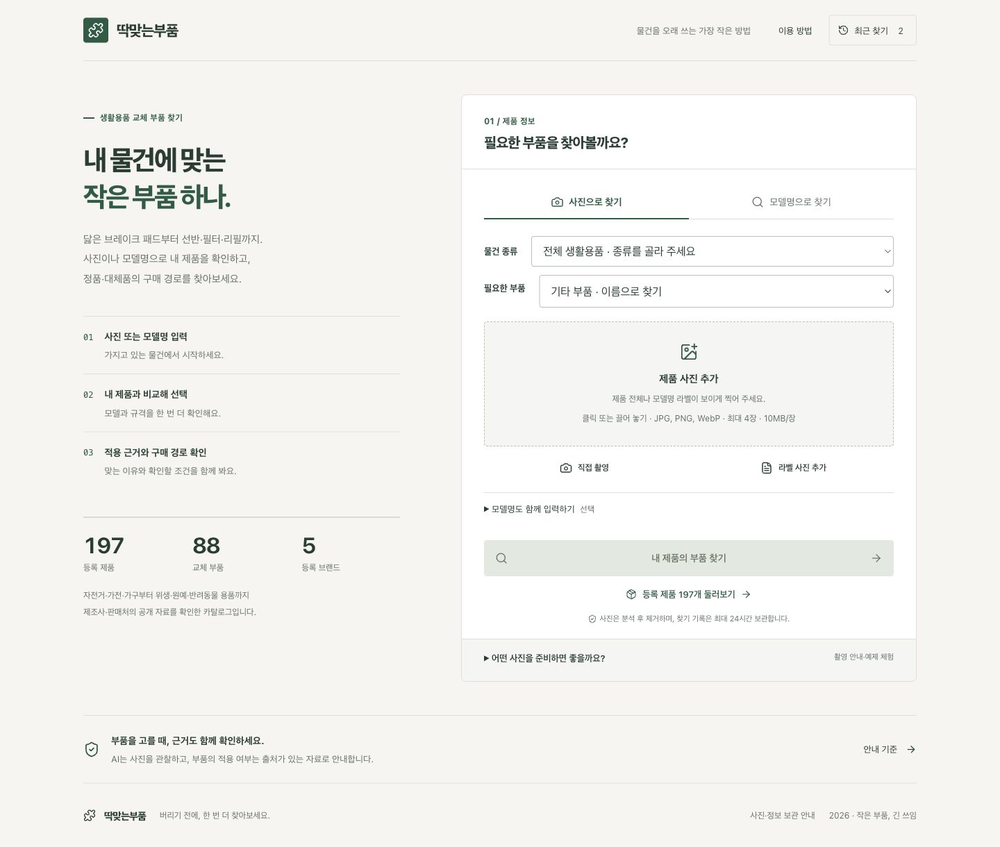
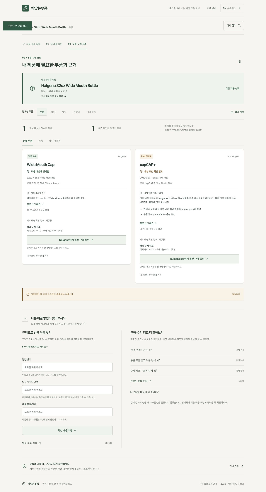
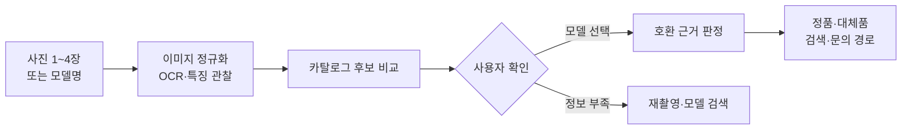
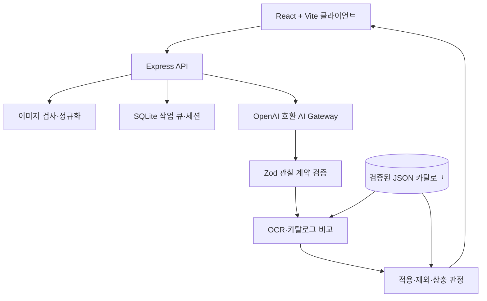

<div align="center">

# 🔎 딱맞는부품

### 사진 한 장에서 시작하는, 근거 중심 부품 탐색

고장 난 물건을 버리기 전에 필요한 부품을 찾고,<br />
**정품·대체품·구매 경로·호환 근거**를 한곳에서 확인하는 한국어 웹 앱입니다.

<br />

[](https://react.dev/)
[](https://www.typescriptlang.org/)
[](https://vite.dev/)
[](https://expressjs.com/)
[](https://nodejs.org/)
[](#-검증)

<br />

**2026 국민대학교 캠퍼스타운 키로톤 · 07팀 뽀쏭뽀쏭**

</div>

---

## ✨ 서비스 소개

제품명이나 부품명을 몰라도 괜찮습니다. 전체 모습, 고장 난 부위, 라벨 사진을 올리면 AI가 보이는 정보만 구조화해 읽고 등록 카탈로그와 비교합니다. 사용자는 후보와 공식 정보를 직접 대조한 뒤 모델을 선택하고, 그 모델에 맞는 부품과 구매 경로를 확인할 수 있습니다.

> **핵심 원칙:** AI가 보지 못한 사실을 추측하지 않고, 재고와 호환성을 분리하며, 근거가 부족하면 모른다고 안내합니다.

<table>
  <tr>
    <td width="50%" align="center"><b>홈 · 사진 및 모델 검색</b></td>
    <td width="50%" align="center"><b>결과 · 근거와 해결 경로</b></td>
  </tr>
  <tr>
    <td></td>
    <td></td>
  </tr>
</table>

## 🚀 주요 기능

| 기능 | 설명 |
|---|---|
| 📷 **사진으로 찾기** | 전체·부품·라벨 사진을 최대 4장까지 분석하고 EXIF 제거, 회전, 축소를 서버에서 처리합니다. |
| 🔤 **모델명으로 찾기** | 한글·영문 별칭, 공백, 하이픈, 전각 문자를 정규화해 등록 제품을 탐색합니다. |
| 🧭 **등록 제품 둘러보기** | 물건 종류·브랜드·용량·부품·국내 구매 경로 기준으로 카탈로그를 필터링합니다. |
| 🧾 **근거 중심 판정** | 적용, 제외, 상충, 미확인을 구분하고 출처·확인 날짜·조건을 함께 표시합니다. |
| 🛒 **다양한 해결 경로** | 정품, 판매처 주장 대체품, 범용 규격, 중고 검색, 제조사 문의를 명확히 구분합니다. |
| 💾 **개인 기록** | 최근 찾기, 확인 항목 저장, 문의 초안 복사, JSON 내보내기, 개인 장착 기록을 지원합니다. |
| 📱 **반응형 UI** | 데스크톱부터 360px 모바일까지 사진 촬영과 결과 확인 흐름을 최적화했습니다. |

## 🧩 지원 분야와 카탈로그

현재 [`data/catalog.json`](data/catalog.json)에 **제품 405개, 부품 111개, 판매 항목 111개, 적용·제외 근거 487개**를 수록했습니다.

| 분야 | 대표 제품 및 부품 |
|---|---|
| 🚲 자전거 | SHIMANO 캘리퍼 31종 · B05S-RX 패드 |
| 🏠 가전 | Dyson 공기청정기·청소기 · 필터, 리모컨, 브러시, 호스 |
| 🪑 가구 | IKEA BILLY 4규격 · 폭별 선반, 예비 부품 신청 |
| ✏️ 학용품 | UNI·Tombow · 단색 리필, 교체 지우개 |
| 🍳 주방·위생 | BRITA·Philips · 필터, 칫솔모 |
| 🛠️ 공구·원예 | OLFA·GARDENA · 교체 날, 패킹 |
| 🐾 반려동물 | PetSafe Drinkwell · 전용 카본 필터 |
| 👶 육아·재봉·운동 | Bugaboo·SINGER·Forclaz · 바퀴, 보빈, 보호캡 |
| 🥤 물병·텀블러 | 197개 모델 · 뚜껑, 패킹, 빨대 |

등록되지 않은 물건은 **기타 부품** 흐름에서 필요한 부품, 장착부, 사용 조건을 기록한 뒤 검색 또는 제조사 문의로 이어갈 수 있습니다.

## 🔄 이용 흐름



1. 사진 또는 모델명으로 탐색을 시작합니다.
2. AI는 관찰 전용 도구만 호출하며 자유 텍스트 응답은 사용하지 않습니다.
3. OCR 원문을 보존하고 `O/0`, `I/1`, `S/5` 같은 불확실 문자를 후보별로 비교합니다.
4. 사용자가 공식 제품 정보와 대조해 모델·규격을 직접 선택합니다.
5. 호환 근거와 구매 가능 상태를 별도로 보여줍니다.

## 🏗️ 시스템 구성



## ⚡ 빠른 시작

### 1. 요구사항

- Node.js **22.17.1 이상**
- npm
- OpenAI 호환 Chat Completions API

### 2. 설치 및 환경 설정

```bash
git clone https://github.com/nxtcloud-edu/2026-kmuct-kt-team07.git
cd 2026-kmuct-kt-team07
npm ci
cp .env.example .env
```

`.env`에 발급받은 값을 입력합니다.

```dotenv
AI_API_BASE_URL=https://your-gateway.example/v1
AI_API_KEY=your-issued-key
AI_MODEL=your-provided-model
```

> API 키는 서버에서만 읽습니다. `.env`, `.data`, 빌드 결과와 의존성 폴더는 Git 및 Docker 컨텍스트에서 제외됩니다.

### 3. 실행

```bash
# 서버와 웹 앱 실행
npm start

# 브라우저
open http://localhost:3001
```

개발 모드는 다음과 같이 실행합니다.

```bash
npm run dev
# http://localhost:5173
```

## 🧪 검증

```bash
# 카탈로그 무결성 + 전체 테스트 + 타입 검사 + 프로덕션 빌드
npm run check
```

- ✅ 자동 테스트 **72개 통과**
- ✅ 서버·클라이언트 타입 검사 통과
- ✅ Vite 프로덕션 빌드 통과
- ✅ Docker 이미지, 운영 모드, SQLite, Secure 쿠키, Linux 이미지 처리 검증
- ✅ Chrome 데스크톱 및 360px·390px 모바일 흐름 확인
- ✅ 런타임 의존성 취약점 0개 확인 *(2026-09-20)*

자동 테스트는 유료 AI를 호출하지 않습니다. 실제 공급자 연결 검사는 사용량이 발생하므로 필요할 때만 `npm run smoke:ai`를 실행하세요.

## 📁 프로젝트 구조

```text
.
├── client/              # React UI와 반응형 스타일
├── server/              # HTTP API, 이미지 처리, 작업 큐, 판정 로직
├── shared/              # 도메인 계약, 검색, 제품 식별 규칙
├── src/                 # AI 게이트웨이, 관찰 검증, OCR 비교
├── data/catalog.json    # 출처를 확인한 제품·부품 카탈로그
├── tests/               # 단위·통합·보안·검색 테스트
├── docs/                # 제품 범위, 운영, 검증 문서
└── artifacts/           # 링크 검사, 화면·컨테이너 검증 결과
```

## 🛡️ 신뢰성과 안전 원칙

- 하나의 후보만 남아도 자동으로 호환을 확정하지 않습니다.
- 제조사 근거와 판매처의 적용 주장을 같은 수준으로 취급하지 않습니다.
- 재고 상태가 호환성 판단을 바꾸지 않도록 분리합니다.
- 링크가 열리는 것만으로 호환이나 재고가 확인됐다고 판단하지 않습니다.
- 실물 장착·누수·내열·내구성은 별도의 실제 검증이 필요합니다.
- 개인 장착 기록은 공개 호환 근거에 자동 반영하지 않습니다.

## 📚 문서

| 문서 | 내용 |
|---|---|
| [제품 범위](docs/product-scope.md) | 요구사항과 지원 범위 |
| [구현 결정](docs/implementation-decisions.md) | 제안과 실제 구현의 차이 |
| [분야 확장](docs/daily-life-expansion.md) | 분야별 근거와 검증 범위 |
| [카탈로그 관리](docs/catalog.md) | 데이터 추가·검수 원칙 |
| [시연 가이드](docs/demo.md) | 공개 예제 사진을 이용한 시연 |
| [배포 안내](docs/deployment.md) | Docker, HTTPS, 운영 환경 설정 |
| [UI 개선](docs/ui-redesign.md) | 반응형 화면 설계와 검증 |

## 🧰 주요 명령어

| 명령어 | 설명 |
|---|---|
| `npm run dev` | 개발 서버 실행 |
| `npm start` | 로컬 앱 실행 |
| `npm run check` | 카탈로그·테스트·빌드 전체 검증 |
| `npm test` | 자동 테스트 실행 |
| `npm run build` | 타입 검사 및 프로덕션 빌드 |
| `npm run catalog:validate` | 카탈로그 스키마·참조 무결성 검사 |
| `npm run catalog:links` | 허용 도메인의 등록 링크 검사 |
| `npm run start:production` | 컴파일된 서버 실행 |

---

<div align="center">

**버리기 전에, 딱 맞는 부품부터.** ♻️

사진 출처와 라이선스는 [`tests/fixtures/ATTRIBUTION.md`](tests/fixtures/ATTRIBUTION.md)에서 확인할 수 있습니다.

</div>
