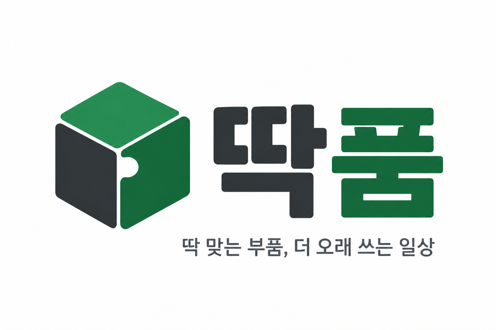
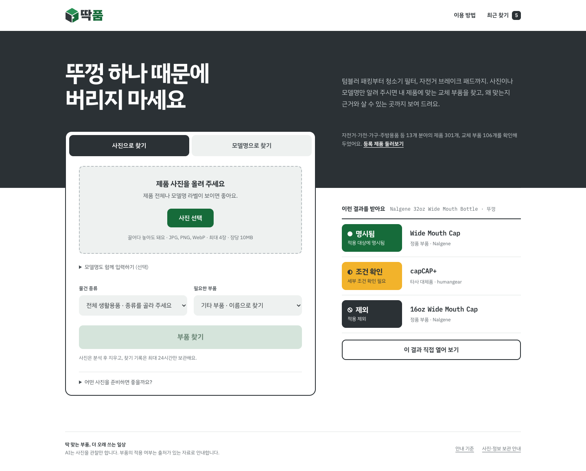
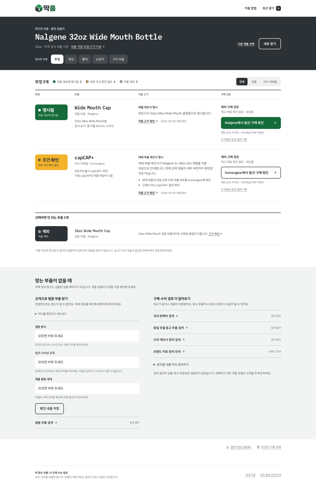
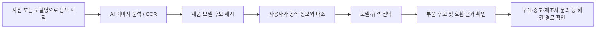
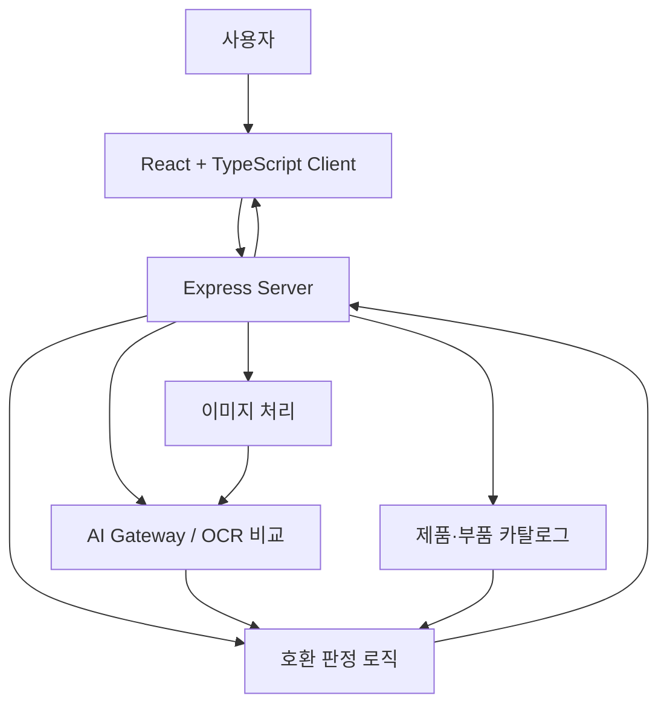

<p align="center">
  
</p>

<h1 align="center">딱품</h1>

<p align="center">
  <strong>딱 맞는 부품, 더 오래 쓰는 일상</strong><br/>
  사진 한 장으로 필요한 생활용품 부품을 찾고,<br/>
  모델·규격·호환 근거까지 확인할 수 있도록 돕는 AI 부품 탐색 서비스
</p>

<p align="center">
  
  
  
  
  
  
</p>

<p align="center">
  <strong>2026 국민대학교 캠퍼스타운 키로톤 · 07팀 뽀쏭뽀쏭</strong>
</p>

---

## 서비스 소개

제품명이나 부품명을 몰라도 괜찮습니다.

사용자가 **제품 전체 사진, 고장 난 부위, 라벨 사진**을 업로드하면 AI가 이미지에서 확인 가능한 정보를 구조화해 읽고, 등록된 카탈로그와 비교합니다.

사용자는 후보 제품과 공식 정보를 직접 대조한 뒤 자신의 모델을 선택하고, 해당 모델에 맞는 **부품 정보·호환 근거·구매 경로**를 확인할 수 있습니다.

> **핵심 원칙**  
> AI가 보지 못한 사실을 추측하지 않고, **재고와 호환성을 분리**하며, 근거가 부족한 경우에는 명확하게 **“확인 필요”**로 안내합니다.

| 홈 · 사진 및 모델 검색 | 결과 · 근거와 해결 경로 |
| --- | --- |
|  |  |

---

## 해결하고자 하는 문제

생활용품의 부품을 교체하려 할 때 사용자는 주로 다음 세 가지 지점에서 막힙니다.

| 문제 | 딱품의 해결 방식 |
| --- | --- |
| **“이 부품을 뭐라고 검색하지?”** | 사진을 통해 부품 종류와 검색에 사용할 수 있는 이름을 제시합니다. |
| **“비슷하게 생겼는데 어떤 걸 사야 하지?”** | 모델명·규격·용량·장착 위치 등 필요한 확인 정보를 안내합니다. |
| **“샀는데 안 맞으면 어떡하지?”** | 제조사 근거, 적용·제외 정보, 실제 장착 기록을 구분해 보여줍니다. |

딱품의 목표는 단순히 사진 속 물건의 이름을 맞히는 것이 아니라,

> **내 제품의 정확한 모델 ↔ 필요한 부품 ↔ 호환 근거 ↔ 구매·해결 경로**

를 연결해 사용자가 실제로 맞는 부품을 찾도록 돕는 것입니다.

---

## 주요 기능

| 기능 | 설명 |
| --- | --- |
| **사진으로 찾기** | 전체·부품·라벨 사진을 최대 4장까지 분석하고, EXIF 제거·회전·축소를 서버에서 처리합니다. |
| **모델명으로 찾기** | 한글·영문 별칭, 공백, 하이픈, 전각 문자를 정규화해 등록 제품을 탐색합니다. |
| **등록 제품 둘러보기** | 물건 종류·브랜드·용량·부품·국내 구매 경로 기준으로 카탈로그를 필터링합니다. |
| **근거 중심 판정** | 적용, 제외, 상충, 미확인을 구분하고 출처·확인 날짜·조건을 함께 표시합니다. |
| **다양한 해결 경로** | 정품, 판매처 주장 대체품, 범용 규격, 중고 검색, 제조사 문의를 명확히 구분합니다. |
| **개인 기록** | 최근 찾기, 확인 항목 저장, 문의 초안 복사, JSON 내보내기, 개인 장착 기록을 지원합니다. |
| **반응형 UI** | 데스크톱부터 360px 모바일까지 사진 촬영과 결과 확인 흐름을 최적화했습니다. |

---

## 지원 분야와 카탈로그

현재 [`data/catalog.json`](./data/catalog.json)에 **제품·적용 계열 470개, 부품 134개, 판매 항목 134개, 적용·제외 근거 573개**를 수록했습니다.

| 분야 | 대표 제품 및 부품 |
|---|---|
| 🚲 자전거 | SHIMANO 캘리퍼 31종 · B05S-RX 패드 |
| 🏠 가전 | Dyson 공기청정기·청소기 · 필터, 리모컨, 브러시, 호스 |
| 🪑 가구 | IKEA BILLY·BESTÅ·PAX · 폭·깊이별 선반, 경첩 |
| ✏️ 학용품 | UNI·Tombow·Brother · 단색·다색 리필, 지우개, 라벨 테이프 |
| 🍳 주방·위생 | BRITA·Philips · 필터, 칫솔모 |
| 🛠️ 공구·원예 | OLFA·GARDENA · 교체 날, 패킹 |
| 🐾 반려동물 | PetSafe Drinkwell · 전용 카본 필터 |
| 👶 육아·재봉·운동 | Bugaboo·SINGER·Forclaz · 바퀴, 보빈, 보호캡 |
| 🧹 청소·배수설비 | Vileda·IKEA · 교체 걸레, 배수구 마개, 연결부 |
| 🥤 물병·텀블러 | 197개 모델 · 뚜껑, 패킹, 빨대 |

등록되지 않은 물건은 **기타 부품** 흐름에서 필요한 부품, 장착부, 사용 조건을 기록한 뒤 검색 또는 제조사 문의로 이어갈 수 있습니다.

---

## 이용 흐름



1. 사진 또는 모델명으로 탐색을 시작합니다.
2. AI는 관찰 전용 도구만 호출하며 자유 텍스트 응답은 사용하지 않습니다.
3. OCR 원문을 보존하고 `O/0`, `I/1`, `S/5`처럼 혼동하기 쉬운 문자를 후보별로 비교합니다.
4. 사용자가 공식 제품 정보와 대조해 모델·규격을 직접 선택합니다.
5. 호환 근거와 구매 가능 상태를 별도로 보여줍니다.

---

## 시스템 구성

발표에는 [실제 AWS 배포 아키텍처](docs/aws-architecture-presentation.svg)를, 구현 검토에는 [상세 시스템 아키텍처](docs/system-architecture.md)를 사용할 수 있습니다.



### 역할 분리

- **Client**: 사진 업로드, 검색, 후보 비교, 결과·근거 표시
- **Server**: HTTP API, 이미지 처리, 작업 큐, 판정 로직
- **AI Gateway**: 이미지 관찰 및 OCR 후보 비교
- **Catalog**: 제품·부품·판매 항목·호환 근거 데이터
- **Shared**: 도메인 계약, 검색 규칙, 제품 식별 규칙

---

## 빠른 시작

### 1. 요구사항

- Node.js **22.17.1 이상**
- npm
- OpenAI 호환 Chat Completions API

### 2. 설치 및 환경 설정

```bash
git clone https://github.com/nxtcloud-edu/2026-kmuct-kt-team07.git
cd 2026-kmuct-kt-team07

npm ci
cp .env.example .env
```

`.env`에 발급받은 값을 입력합니다.

```env
AI_API_BASE_URL=https://your-gateway.example/v1
AI_API_KEY=your-issued-key
AI_MODEL=your-provided-model
```

> API 키는 서버에서만 읽습니다.  
> `.env`, `.data`, 빌드 결과와 의존성 폴더는 Git 및 Docker 컨텍스트에서 제외됩니다.

### 3. 개발 모드 실행

```bash
npm run dev
```

브라우저에서 아래 주소로 접속합니다.

```text
http://localhost:5173
```

### 4. 서버와 웹 앱 실행

```bash
npm start
```

```text
http://localhost:3001
```

---

## 검증

전체 검증:

```bash
npm run check
```

현재 확인된 항목:

- 자동 테스트 **72개 통과**
- 서버·클라이언트 타입 검사 통과
- Vite 프로덕션 빌드 통과
- Docker 이미지·운영 모드·SQLite·Secure 쿠키·Linux 이미지 처리 검증
- Chrome 데스크톱 및 **360px·390px 모바일** 흐름 확인
- 런타임 의존성 취약점 0개 확인 *(2026-09-20)*

자동 테스트는 유료 AI를 호출하지 않습니다.

실제 공급자 연결 검사는 사용량이 발생할 수 있으므로 필요한 경우에만 실행합니다.

```bash
npm run smoke:ai
```

---

## 프로젝트 구조

```text
.
├── client/              # React UI와 반응형 스타일
├── server/              # HTTP API, 이미지 처리, 작업 큐, 판정 로직
├── shared/              # 도메인 계약, 검색, 제품 식별 규칙
├── src/                 # AI 게이트웨이, 관찰 검증, OCR 비교
├── data/
│   └── catalog.json     # 출처를 확인한 제품·부품 카탈로그
├── tests/               # 단위·통합·보안·검색 테스트
├── docs/                # 제품 범위, 운영, 검증 문서
└── artifacts/           # 링크 검사, 화면·컨테이너 검증 결과
```

---

## 신뢰성과 안전 원칙

딱품은 **“비슷하게 생김”과 “사용 가능함”을 같은 의미로 취급하지 않습니다.**

- 하나의 후보만 남아도 자동으로 호환을 확정하지 않습니다.
- 제조사 근거와 판매처의 적용 주장을 같은 수준으로 취급하지 않습니다.
- 재고 상태가 호환성 판단을 바꾸지 않도록 분리합니다.
- 링크가 열리는 것만으로 호환이나 재고가 확인됐다고 판단하지 않습니다.
- 실물 장착·누수·내열·내구성은 별도의 실제 검증이 필요합니다.
- 개인 장착 기록은 공개 호환 근거에 자동 반영하지 않습니다.

### 호환 상태 예시

| 상태 | 의미 |
| --- | --- |
| **제조사 호환 확인** | 공식 자료에서 해당 모델·세대와의 호환이 확인됨 |
| **사용자 장착 사례** | 동일 모델에 실제 장착한 기록이 있음 |
| **추가 확인 필요** | 형태·일부 규격은 맞지만 중요한 정보가 부족함 |
| **불일치 확인** | 규격·결합 구조가 다르거나 실패 근거가 있음 |

---

## 문서

| 문서 | 내용 |
| --- | --- |
| [`docs/product-scope.md`](./docs/product-scope.md) | 요구사항과 지원 범위 |
| [`docs/implementation-decisions.md`](./docs/implementation-decisions.md) | 제안과 실제 구현의 차이 |
| [`docs/daily-life-expansion.md`](./docs/daily-life-expansion.md) | 분야별 근거와 검증 범위 |
| [`docs/catalog.md`](./docs/catalog.md) | 데이터 추가·검수 원칙 |
| [`docs/demo.md`](./docs/demo.md) | 공개 예제 사진을 이용한 시연 |
| [`docs/deployment.md`](./docs/deployment.md) | Docker, HTTPS, 운영 환경 설정 |
| [`docs/ui-redesign.md`](./docs/ui-redesign.md) | 반응형 화면 설계와 검증 |

---

## 주요 명령어

| 명령어 | 설명 |
| --- | --- |
| `npm run dev` | 개발 서버 실행 |
| `npm start` | 로컬 앱 실행 |
| `npm run check` | 카탈로그·테스트·빌드 전체 검증 |
| `npm test` | 자동 테스트 실행 |
| `npm run build` | 타입 검사 및 프로덕션 빌드 |
| `npm run catalog:validate` | 카탈로그 스키마·참조 무결성 검사 |
| `npm run catalog:links` | 허용 도메인의 등록 링크 검사 |
| `npm run start:production` | 컴파일된 서버 실행 |

---

## Team 뽀쏭뽀쏭

**2026 국민대학교 캠퍼스타운 키로톤 · 07팀**

우리는 생활 속에서 작은 부품 하나를 구하지 못해 멀쩡한 물건을 버리는 문제에 주목했습니다.

딱품은 단순한 이미지 검색이 아니라,

> **“그래서 정확히 어떤 부품을 사야 하는가?”**

까지 연결하는 서비스를 지향합니다.

---

<p align="center">
  <strong>버리기 전에, 딱 맞는 부품부터.</strong>
</p>

<p align="center">
  사진 출처와 라이선스는
  <a href="./tests/fixtures/ATTRIBUTION.md">tests/fixtures/ATTRIBUTION.md</a>
  에서 확인할 수 있습니다.
</p>
