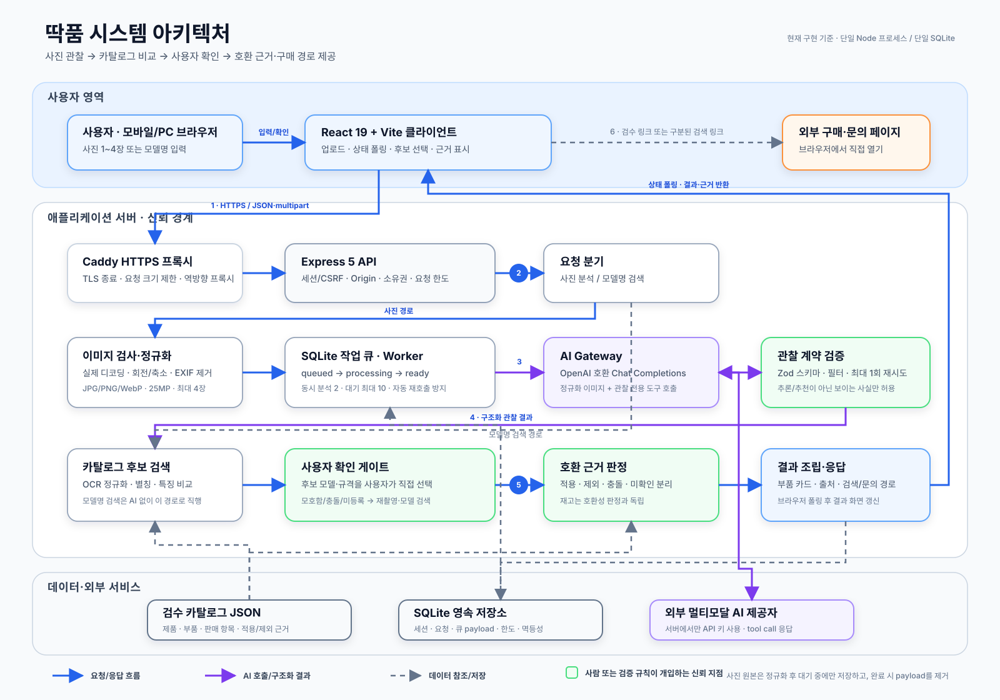
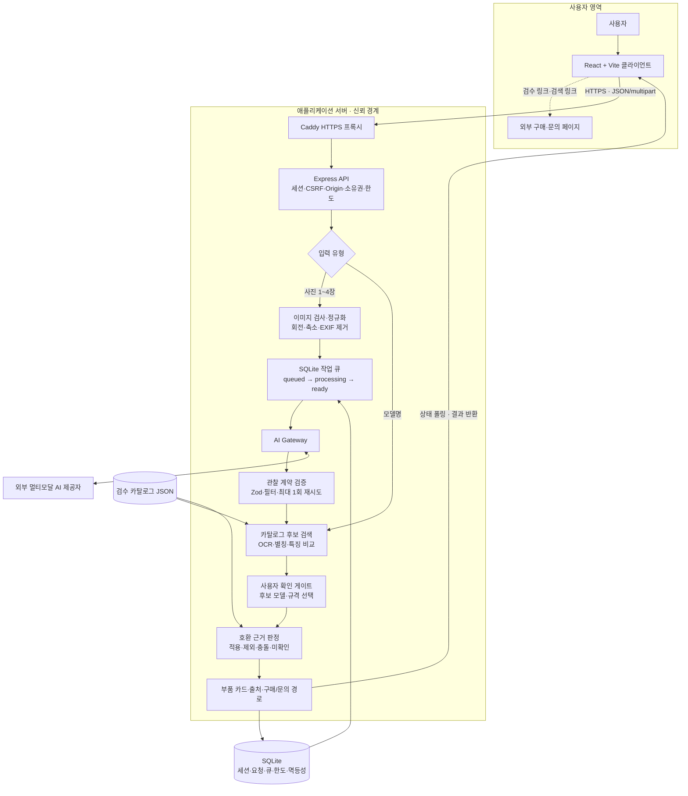

# 딱품 시스템 아키텍처

## 그림 명세

- **보고서 위치:** 구현 방법 / 시스템 설계
- **독자 질문:** 사진이나 모델명이 어떤 경로를 거쳐 근거가 있는 부품 후보와 구매 경로로 변환되는가?
- **핵심 메시지:** AI는 사진에서 보이는 사실을 구조화하는 역할만 맡고, 제품 후보 비교와 호환 판정은 검수 카탈로그·명시적 규칙·사용자 확인을 거친다.
- **신뢰 경계:** 세션·CSRF·Origin·소유권·요청 한도를 API에서 검사하고, AI 출력은 Zod 관찰 계약을 통과해야 한다.
- **보관 정책:** 사진 payload는 작업 완료 후 제거하며, 세션과 찾기 기록은 최대 24시간 보관한다.

## 편집 가능한 흐름도

## 주요 설계 판단

1. **사진 경로와 모델명 경로를 분리한다.** 모델명 검색은 AI 호출 없이 카탈로그 검색으로 직행한다.
2. **AI 출력을 최종 판정으로 사용하지 않는다.** AI는 `record_observation` 도구로 관찰 사실만 반환하고, 후보 검색과 호환성 판정은 애플리케이션이 수행한다.
3. **사용자가 모델을 확정한다.** 후보가 하나여도 자동으로 호환을 확정하지 않으며, 모호함·충돌·미등록 상태는 재촬영이나 모델 검색으로 되돌린다.
4. **호환성과 재고를 분리한다.** 판매 가능 여부가 적용 근거를 상향하지 않도록 독립 상태로 계산한다.
5. **단일 인스턴스 운영을 전제로 한다.** 현재 작업 큐·세션·요청 한도는 로컬 SQLite에 있으므로, 다중 인스턴스 확장 시 공유 저장소와 분산 작업 잠금으로 교체해야 한다.

> **그림 캡션:** 그림 1. 딱품의 전체 시스템 아키텍처. 사진 입력은 서버에서 정규화된 뒤 작업 큐와 AI 관찰 계약을 거치며, 모델명 입력은 카탈로그 검색으로 바로 전달된다. 두 경로 모두 검수 카탈로그 비교, 사용자 확인, 규칙 기반 호환 근거 판정을 거쳐 결과를 생성한다.
